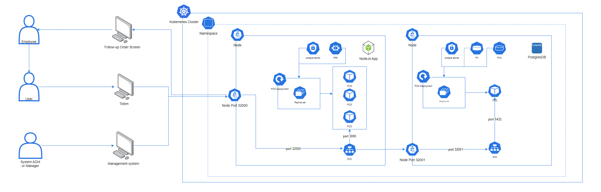
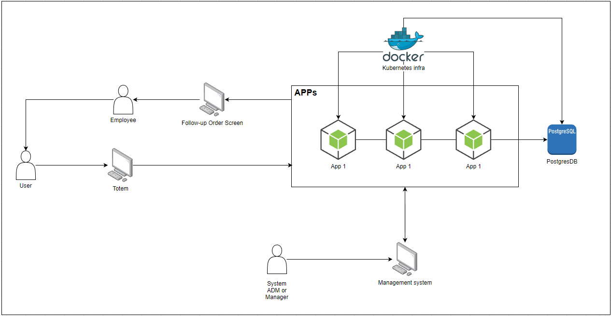

<div align="center">
<h1 align="center">

<br>FIAP-LANCHES</h1>
<h3>◦ Desenvolvido com:</h3>

<p align="center">


</p>


</div>

---

## 📖 Conteudo
- [📖 Conteudo](#-conteudo)
- [✨ Objetivos](#-objetivos)
- [📜 Arquitetura](#-arquitetura)
- [📜 Vídeo Explicação Arquitetura](#-explicação-arquitetura)
- [🌐 Swagger - API Coleção](#-swagger---api-coleção)
- [📂 Estrutura do Repositório](#-estrutura-do-repositório)
  - [🤖 Executando fiap-lanches - Docker](#-executando-fiap-lanches---docker)
  - [🧪 Testes](#-testes)
  - [🤖 Executando fiap-lanches - Kubernetes](#-executando-fiap-lanches---kubernetes)
  - [🤖 Executando fiap-lanches - helm Local](#-executando-fiap-lanches---helm-local)
  - [🤖 Executando fiap-lanches - helm repository](#-executando-fiap-lanches---helm-repository)

---

## ✨ Objetivos

O FiapLanches foi um grande sucesso, e com esse sucesso surgiu a necessidade de expansão. No entanto, foram identificados problemas com o atendimento ao cliente e o gerenciamento de pedidos.

Sem um sistema de gerenciamento de pedidos, pode haver confusão entre os atendentes e a cozinha, resultando em atrasos na preparação e entrega de pedidos. Pedidos podem ser perdidos, interpretados erroneamente ou esquecidos, o que leva à insatisfação do cliente e possíveis perdas de negócios.

Como solução, é necessário um sistema de gerenciamento de pedidos para garantir que o estabelecimento possa atender os clientes de forma eficiente, gerenciando seus pedidos e estoques adequadamente.

Para resolver esse problema, este repositório foi criado com a intenção de ser um sistema de autosserviço e gerenciamento de fast food que oferece facilidade para os clientes fazerem e receberem seus pedidos. Ele também auxilia os funcionários no gerenciamento desses pedidos, permitindo o controle sobre estratégias de marketing e o gerenciamento de funcionários.

## 📜 Arquitetura

Completa


Simplificada



## 📜 Explicação Arquitetura
[Link para o vídeo explicativo](https://www.youtube.com/watch?v=aan1C66lmbY)


## 🌐 Swagger - API Coleção

[API Coleção](others/api_collection/fiapLanchesEndpointCollections.json) ou depois de rodar o projeto acesse o swagger: [Swagger](http://localhost:3000/api-docs/)

## 📂 Estrutura do repositório


```sh
└── fiap-lanches/fiap-lanches-clean/
    ├── app/
    │    ├── src/
    │    │   ├── configurations/
    │    │   │   ├── DataSource.ts
    │    │   │   ├── InjectionDependency.ts
    │    │   │   ├── Swagger.ts
    │    │   │   ├── WinstonLog.ts
    │    │   ├── domain/
    │    │   │   ├── enums/
    │    │   │   │   ├── EOrderStatus.ts
    │    │   │   │   ├── EPayment.ts
    │    │   │   │   ├── EProductCategory
    │    │   │   │   ├── EPromotionStatus
    │    │   │   ├── models/
    │    │   │   │   ├── IClientModel.ts
    │    │   │   │   ├── IEmployeeModel.ts
    │    │   │   │   ├── IOrderModel.ts
    │    │   │   │   ├── IProductModel.ts
    │    │   │   │   ├── IPromotionModel.ts
    │    │   ├── repositories/
    │    │   │   ├── entity/
    │    │   │   │   ├── ClientEntity.ts
    │    │   │   │   ├── EmployeeEntity.ts
    │    │   │   │   ├── OrderEntity.ts
    │    │   │   │   ├── ProductEntity.ts
    │    │   │   │   ├── PromotionEntity.ts
    │    │   │   ├── impl/
    │    │   │   │   ├── ClientRepository.ts
    │    │   │   │   ├── EmployeeRepository.ts
    │    │   │   │   ├── OrderRepository.ts
    │    │   │   │   ├── ProductRepository.ts
    │    │   │   │   ├── PromotionRepository.ts
    │    │   │   ├── interfaces/
    │    │   │   │   ├──IClientRepository.ts
    │    │   │   │   ├──IEmployeeRepository.ts
    │    │   │   │   ├──IOrderRepository.ts
    │    │   │   │   ├──IProductRepository.ts
    │    │   │   │   ├──IPromotionRepository.ts
    │    │   ├── resources/
    │    │   │   ├── controllers/
    │    │   │   ├── midleware/
    │    │   │   ├── routers/
    │    │   │   ├── schemas/
    │    │   ├── services/
    │    │   ├── tests/
    │    │   └── index.ts
    │    ├── jest.config.js
    │    ├── package-lock.json
    │    ├── package.json
    │    └── tsconfig.json
    └── kubernates/
    │   ├── fiap-lanches-api-deployment.yaml
    │   ├── hpa.yaml
    │   ├── metrics.yaml
    │   ├── postgres-deployment.yaml
    │   ├── postgres-pv.yaml
    │   ├── postgres-pvc.yaml
    │   ├── postgres-secret.yaml
    │   ├── svc-lanches-api.yaml
    │   └── svc-postgress.yaml


```

```sh
└── fiap-lanches/fiap-lanches-hexagonal/
    ├── Dockerfile
    ├── docker-compose.yml
    ├── jest.config.js
    ├── package-lock.json
    ├── package.json
    ├── src/
    │   ├── adapter/
    │   │   ├── driven/
    │   │   └── driver/
    │   ├── config/
    │   │   ├── DataSource.ts
    │   │   ├── RedisConfig.ts
    │   │   ├── Swagger.ts
    │   │   └── WinstonLog.ts
    │   ├── core/
    │   │   ├── applications/
    │   │   └── domain/
    │   ├── shared/
    │   │   └── container/
    │   └── test/
    │       ├── client/
    │       ├── employee/
    │       ├── order/
    │       ├── payment/
    │       └── product/
    │   fiap-lanches-api-deployment.yaml
    │   hpa.yaml
    │   metrics.yaml
    │   postgres-deployment.yaml
    │   postgres-pv.yaml
    │   postgres-pvc.yaml
    │   postgres-secret.yaml
    │   svc-lanches-api.yaml
    │   svc-postgress.yaml
    └── tsconfig.json

```

### 🤖 Executando fiap-lanches - Docker
1. Clone the fiap-lanches repository:
```sh
git clone git@github.com:Marques0x01/fiap-lanches.git
```

2. Mudar pasta do projeto:
```sh
cd fiap-lanches/fiap-lanches-clean
```

3. Rodar com docker:
```sh
docker compose up
```

### 🧪 Testes
```sh
npm test
```

---

### 🤖 Executando fiap-lanches - Kubernetes
1. Clone o repositório fiap-lanches:
```sh
git clone git@github.com:Marques0x01/fiap-lanches.git
```

2. Mudar pasta do projeto:
```sh
cd fiap-lanches
cd fiap-lanches-clean
cd kubernetes
```


2.1. Executar todos os comando kubernetes juntos ou segregados igual abaixo:
```sh
kubectl apply -f metrics.yaml &&
kubectl apply -f postgres-secret.yaml &&
kubectl apply -f svc-postgress.yaml &&
kubectl apply -f postgres-pv.yaml    &&
kubectl apply -f postgres-pvc.yaml   &&
kubectl apply -f postgres-deployment.yaml &&
kubectl apply -f svc-lanches-api.yaml &&
kubectl apply -f fiap-lanches-api-deployment.yaml
```

3. Subir as metricas:
```sh
kubectl apply -f metrics.yaml
```

4. Subir secrets do postgres:
```sh
kubectl apply -f postgres-secret.yaml
```

5. Subir service do postgres:
```sh
kubectl apply -f svc-postgress.yaml
```

6. Subir service do postgres:
```sh
kubectl apply -f postgres-pv.yaml   
```

7. Subir service do postgres:
```sh
kubectl apply -f postgres-pvc.yaml  
```

8. Subir deployment do postgres:
```sh
kubectl apply -f postgres-deployment.yaml
```

9. Subir service do fiap lanches:
```sh
kubectl apply -f svc-lanches-api.yaml
```

10. Subir deployment do fiap lanches:
```sh
kubectl apply -f fiap-lanches-api-deployment.yaml
```

11. Acesse o swagger:
```sh
http://localhost:32000/api-docs/
```

---

### 🤖 Executando fiap-lanches - helm Local
1. Adicione repository metrics-server:
```sh
helm repo add metrics-server https://kubernetes-sigs.github.io/metrics-server/
```

2. Instale o chart metrics-server:
```sh
helm install my-metrics-server metrics-server/metrics-server --version 3.11.0
```

3. Acessar a pasta helm/postgres-helm/:
```sh
cd helm/postgres-helm/
```

4. Gerar o pacote com helm:
```sh
helm package postgres-fiap-lanches   
```

5. Fazer instalação do postgres-fiap-lanches:
```sh
helm install postgres-fiap-lanches ./docs/postgres-fiap-lanches-0.1.0.tgz  
```

6. Acessar a posta helm/fiap-lanches-helm/:
```sh
cd helm/fiap-lanches-helm/
```

7. Gerar o pacote com helm:
```sh
helm package fiap-lanches   
```

8. Fazer instalação do fiap-lanches:
```sh
helm install fiap-lanches ./docs/fiap-lanches-0.1.0.tgz  
```

---

### 🤖 Executando fiap-lanches - helm repository
1. Adicione o repositório metrics-server:
```sh
helm repo add metrics-server https://kubernetes-sigs.github.io/metrics-server/
```

2. Intale o chart metrics-server:
```sh
helm install my-metrics-server metrics-server/metrics-server --version 3.11.0
```

3. Adicione o repositório postgres-fiap-lanches:
```sh
helm repo add postgres-fiap-lanches https://jonathansantoss.github.io/postgres-fiap-lanches
```

4. Instale o chart postgres-fiap-lanches:
```sh
helm install svc-postgres postgres-fiap-lanches/svc-postgres --version 0.1.0
```

5. Adicione o repositório fiap-lanches:
```sh
helm repo add fiap-lanches https://jonathansantoss.github.io/fiap-lanches-helm
```

6. Intale o chart fiap-lanches:
```sh
helm install fiap-lanches fiap-lanches/fiap-lanches --version 0.1.0
```

---

[**Return**](#Top)

---
