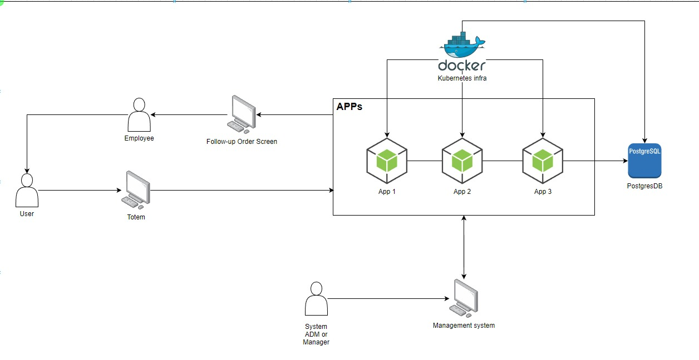

<div align="center">
<h1 align="center">

<br>FIAP-LANCHES</h1>
<h3>◦ Developed with the software and tools below.</h3>

<p align="center">


</p>


</div>

---

## 📖 Table of Contents
- [📖 Table of Contents](#-table-of-contents)
- [✨ Objectives](#-objectives)
- [📜 Architecture](#-architecture)
- [🌐 Swagger - API Collection](#-swagger---api-collection)
- [📂 Repository Structure](#-repository-structure)
  - [🤖 Running fiap-lanches - Docker](#-running-fiap-lanches---docker)
  - [🧪 Tests](#-tests)
  - [🤖 Running fiap-lanches - Kubernetes](#-running-fiap-lanches---kubernetes)
  - [🤖 Running fiap-lanches - helm Local](#-running-fiap-lanches---helm-local)
  - [🤖 Running fiap-lanches - helm repository](#-running-fiap-lanches---helm-repository)

---

## ✨ Objectives

FiapLanches was a great success, and with that success came the need for expansion. However, issues were identified with customer service and order management.

Without an order management system, there can be confusion between the attendants and the kitchen, leading to delays in order preparation and delivery. Orders might get lost, misinterpreted, or forgotten, resulting in customer dissatisfaction and potential loss of business.

As a solution, a system for order management is required to ensure that the establishment can efficiently serve customers, managing their orders and stocks appropriately.

To address this issue, this repository has been created with the intention of being a self-service and fast food management system that provides ease for customers to place and receive their orders. It also assists employees in managing these orders while enabling control over marketing strategies and employees management.

## 📜 Architecture



## 🌐 Swagger - API Collection

[API Collection](others/api_collection/fiapLanchesEndpointCollections.json) or After running application you can access swagger: [Swagger](http://localhost:3000/api-docs/)

## 📂 Repository Structure

```sh
└── fiap-lanches/
    ├── Dockerfile
    ├── docker-compose.yml
    ├── jest.config.js
    ├── package-lock.json
    ├── package.json
    ├── src/
    │   ├── adapter/
    │   │   ├── driven/
    │   │   └── driver/
    │   ├── config/
    │   │   ├── DataSource.ts
    │   │   ├── RedisConfig.ts
    │   │   ├── Swagger.ts
    │   │   └── WinstonLog.ts
    │   ├── core/
    │   │   ├── applications/
    │   │   └── domain/
    │   ├── shared/
    │   │   └── container/
    │   └── test/
    │       ├── client/
    │       ├── employee/
    │       ├── order/
    │       ├── payment/
    │       └── product/
    └── tsconfig.json

```

### 🤖 Running fiap-lanches - Docker
1. Clone the fiap-lanches repository:
```sh
git clone https://gitlab.com/jonathan.gomess1/fiap-lanches
```

2. Change to the project directory:
```sh
cd fiap-lanches
```

3. Run with docker:
```sh
docker compose up
```

### 🧪 Tests
```sh
npm test
```

---

### 🤖 Running fiap-lanches - Kubernetes
1. Clone the fiap-lanches repository:
```sh
git clone https://gitlab.com/jonathan.gomess1/fiap-lanches
```

2. Change to the project directory:
```sh
cd fiap-lanches
```

3. subir as metricas:
```sh
kubectl apply -f metrics.yaml
```

4. Subir secrets do postgres:
```sh
kubectl apply -f postgres-secret.yaml
```

5. Subir service do postgres:
```sh
kubectl apply -f svc-postgress.yaml
```

6. Subir deployment do postgres:
```sh
kubectl apply -f postgres-deployment.yaml
```

7. Subir service do fiap lanches:
```sh
kubectl apply -f svc-lanches-api.yaml
```

8. Subir deployment do fiap lanches:
```sh
kubectl apply -f fiap-lanches-api-deployment.yaml
```

9. Subir hpa do fiap lanches:
```sh
kubectl apply -f hpa.yaml
```

---

### 🤖 Running fiap-lanches - helm Local
1. Add repository metrics-server:
```sh
helm repo add metrics-server https://kubernetes-sigs.github.io/metrics-server/
```

2. Install chart metrics-server:
```sh
helm install my-metrics-server metrics-server/metrics-server --version 3.11.0
```

3. Acessar a pasta helm/postgres-helm/:
```sh
cd helm/postgres-helm/
```

4. Gerar o pacote com helm:
```sh
helm package postgres-fiap-lanches   
```

5. Fazer instalação do postgres-fiap-lanches:
```sh
helm install postgres-fiap-lanches ./docs/postgres-fiap-lanches-0.1.0.tgz  
```

6. Acessar a posta helm/fiap-lanches-helm/:
```sh
cd helm/fiap-lanches-helm/
```

7. Gerar o pacote com helm:
```sh
helm package fiap-lanches   
```

8. Fazer instalação do fiap-lanches:
```sh
helm install fiap-lanches ./docs/fiap-lanches-0.1.0.tgz  
```

---

### 🤖 Running fiap-lanches - helm repository
1. Add repository metrics-server:
```sh
helm repo add metrics-server https://kubernetes-sigs.github.io/metrics-server/
```

2. Install chart metrics-server:
```sh
helm install my-metrics-server metrics-server/metrics-server --version 3.11.0
```

3. Add repository postgres-fiap-lanches:
```sh
helm repo add postgres-fiap-lanches https://jonathansantoss.github.io/postgres-fiap-lanches
```

4. Install chart postgres-fiap-lanches:
```sh
helm install svc-postgres postgres-fiap-lanches/svc-postgres --version 0.1.0
```

5. Add repository fiap-lanches:
```sh
helm repo add fiap-lanches https://jonathansantoss.github.io/fiap-lanches-helm
```

6. Install chart fiap-lanches:
```sh
helm install fiap-lanches fiap-lanches/fiap-lanches --version 0.1.0
```

---

[**Return**](#Top)

---
